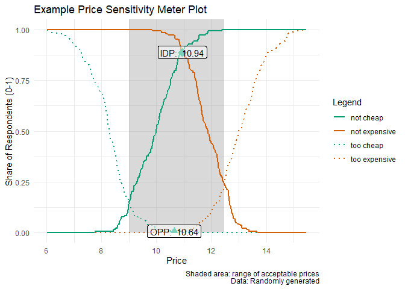

# pricesensitivitymeter

[](https://cran.r-project.org/package=pricesensitivitymeter)
[](https://cran.r-project.org/package=pricesensitivitymeter)
[](https://github.com/max-alletsee/pricesensitivitymeter/actions)
[](https://app.codecov.io/gh/max-alletsee/pricesensitivitymeter)

## Overview

pricesensitivitymeter is an implementation of the van Westendorp Price
Sensitivity Meter (PSM) in R, which is a popular method in market
research to analyze consumer price preferences and price sensitivity. It
also covers the so-called Newton Miller Smith Extension which allows to
estimate prices that maximize the reach (trial rate) and the revenue.

## Installation

As of version 0.2.1, this package is [available on
CRAN](https://cran.r-project.org/package=pricesensitivitymeter).

``` r
# install the stable release from CRAN
install.packages("pricesensitivitymeter")

# install the development version from Github
devtools::install_github("max-alletsee/pricesensitivitymeter")
```

## Usage

The main function of the package is `psm_analysis()` which performs all
necessary analyses.

``` r
## creating example data

tch <- round(rnorm(n = 250, mean = 8.5, sd = 1), digits = 2)
ch <- round(rnorm(n = 250, mean = 10, sd = 1), digits = 2)
ex <- round(rnorm(n = 250, mean = 12, sd = 0.75), digits = 2)
tex <- round(rnorm(n = 250, mean = 13, sd = 1), digits = 2)

data_psm_demo <- data.frame(tch, ch, ex, tex)

library(pricesensitivitymeter)

## running the analysis
output_psm_demo <- psm_analysis(
  toocheap = "tch",
  cheap = "ch",
  expensive = "ex",
  tooexpensive = "tex",
  data = data_psm_demo
)

summary(output_psm_demo)
#> Van Westendorp Price Sensitivity Meter Analysis
#> 
#> Accepted Price Range: 9.28 - 12.5 
#> Indifference Price Point: 11.1 
#> Optimal Price Point: 10.62 
#> 
#> ---
#> 150 cases with individual price preferences were analyzed (unweighted data).
#> Total data set consists of 250 cases. Analysis was limited to cases with transitive price preferences.
#> (Removed: n = 100 / 40% of data)
```

The package also has a function `psm_analysis_weighted()` that deals
with weighted survey data where the survey design for the weighting is
coming from the `survey` package. (Please see the documentation and the
vignette for more details.) Moreover, there is a convenience function
`psm_plot()` that creates the layout for the standard Price Sensitivity
Meter plot via `ggplot2`. Below is a simple example, using the analysis
result created above.

``` r
library(ggplot2)

psm_plot(output_psm_demo) +
  labs(
    x = "Price",
    y = "Share of Respondents (0-1)",
    title = "Example Price Sensitivity Meter Plot",
    caption = "Shaded area: range of acceptable prices\nData: Randomly generated") + 
  theme_minimal()
```

<!-- -->

## Additional Information

-   Please [report any issues or
    bugs](https://github.com/max-alletsee/pricesensitivitymeter/issues).
-   License: MIT

## References

Van Westendorp, P (1976) “NSS-Price Sensitivity Meter (PSM) – A new
approach to study consumer perception of price” *Proceedings of the
ESOMAR Congress*, 139–167. Online available at [the ESOMAR
website](https://archive.researchworld.com/a-new-approach-to-study-consumer-perception-of-price/).

Newton, D, Miller, J, Smith, P, (1993) “A market acceptance extension to
traditional price sensitivity measurement” *Proceedings of the American
Marketing Association Advanced Research Techniques Forum*.
